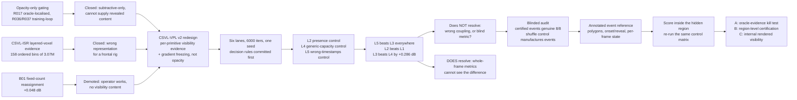

# Supervisor Meeting Brief — Occlusion Evidence and Capacity in ADAGS

Date: 2026-07-30
Tier: exploratory. One scene (`cut_roasted_beef`), one seed, no annotated events.
Nothing here is a claim-grade result. Branches: `csvl-vpl-v2-phase0` (pushed at
`e996d43`), `csvl-vpl-v2-exploratory` (7 commits, not pushed).

## One-minute headline

My problem is occlusion in dynamic Gaussian splatting: when a hand or knife
sweeps over the food, the surface underneath goes unobserved for dozens of
frames, and current methods smear it, delete it, or rebuild it wrongly on reveal.

Two earlier attempts are now closed. Opacity-only gating — hiding the primitives
in the occluded region — failed twice, once with perfect region localisation.
And my previous evidence design (CSVL-ISR) represented occlusion as layered
voxel occupancy, which on a frontal camera rig yields almost nothing: 158 usable
ordered bins out of 3.07M.

So I rebuilt both halves. Evidence became a per-primitive, per-camera, per-frame
visibility verdict from calibrated multi-view depth. The mechanism became
gradient freezing, visibility-normalised densification, and budget-neutral birth
— never opacity. I then ran six full trainings including a control fed evidence
from the **wrong timestamps**. That control won on every whole-image metric.

That does not show the mechanism is wrong. It shows whole-image PSNR/SSIM/LPIPS
cannot distinguish right from wrong occlusion evidence, because the affected
pixels are a fraction of a percent of the frame.

**The question I want to resolve:** is localised, human-annotated event-region
evaluation the right next instrument, or would you reach for a different
measurement?

---

## Recommended meeting flow (35–40 minutes)

1. **Problem and what is already ruled out (5 min).** Occlusion in scene terms,
   then the three closed routes: opacity gating, layered-voxel evidence,
   fixed-count reassignment.
2. **The redesign and why it is shaped this way (5 min).** Evidence, mechanism,
   and the deliberate constant-primitive-count constraint.
3. **The six lanes and the logic of each control (6 min).** The most important
   part — each control exists to kill one named alternative explanation.
4. **Results, decision rules, activation (6 min).** What the numbers license and
   what they do not.
5. **The blinded visual audit (5 min).** Independent check on the evidence, and
   the control defect it exposed.
6. **What I am doing now: annotation (5 min).** Plus the four sign-off decisions
   I need from you.
7. **Candidate next directions (3 min).** Three proposals to react to.
8. **Discussion (5 min).** Use the questions in §10.

---

## Glossary

| Term | Meaning |
|---|---|
| **Primitive / Gaussian** | One of ~0.5M blobs making up the scene. Rendering sorts and blends them per pixel. |
| **Densification** | Standard 3DGS cloning/splitting of primitives where accumulated image-error gradient is large. How capacity gets allocated. |
| **Visibility evidence** | My derived per-(primitive, camera, frame) verdict: is this primitive the first surface along the ray, or is something in front? From calibrated depth, never from labels. |
| **Protection** | Freezing parameter updates of a primitive while it is hidden in every camera of the batch, so gradients it cannot explain do not corrupt it. |
| **Exposure normalisation** | Dividing accumulated densification gradient by how much the primitive was actually *visible*, not by elapsed frames. Published idea (TAD-GS); here both a limb and a control. |
| **Birth / retirement** | Creating primitives at a detected model deficit and removing others so the total is unchanged. |
| **Point-neutral** | Every creation paid for by equal removals, verified per transaction. Blocks "it just used more capacity". |
| **Lane** | One complete 6000-iteration training with one configuration. Six lanes, L0–L5. |
| **Wrong-timestamps control (L5)** | Identical to the full mechanism, but every evidence lookup comes from frame `(f + 101) mod 300`: same statistics, same cross-camera consistency, no correspondence to what is actually occluded. |
| **Presence control (L2)** | Reweights densification by how *present* a primitive is over time, blind to what is in front of what. Separates "occlusion matters" from "any temporal weighting matters". |
| **Census** | Cheap label-free audit counting how many occlusion opportunities exist and checking a detection rule against a control. Ran twice; both no-go. |
| **R009** | Five historical evaluation windows used across many earlier experiments. Historical continuity only — never a clean holdout, never tuned on. |

---

## Visual guide — show these in order

### Figure 1 — the visibility evidence is geometrically correct

Top row is ground truth (camera 08, frames 165/175/185: a person leaning over a
cutting board with a knife). The three lower rows are checkpoints 1000/3000/6000,
each showing the reconstruction with every primitive coloured by its visibility
verdict. Green `near-surface` blankets the blinds and back wall; a distinct
**red arc of `occluded` verdicts traces the region immediately behind the
person's torso**, with orange `in-front` on the near side and grey
`not-evaluable` over the body and dark window panes. The red arc moves with the
person across columns and holds position across all three checkpoints.

Say this before the results: the evidence is not noise, so the negative in §4 is
not explained by broken evidence.

### Figure 2 — what a certified event looks like on real evidence

Camera 02, frames 217–245, judged blind as a genuine disocclusion. A hand draws a
knife across a board with meat; the red circle marks the tracked surface point on
the board. In the depth row the knife appears as a dark near-surface blade
crossing directly over that point. The timeline shows the primitive's own depth
flat at ~5.58 while evidence depth at the pixel drops from ~5.47 to ~4.90 between
frames 226 and 237, then returns; 5–10 other cameras witness the primitive as
visible throughout. State strip: near-surface → behind for ~10 frames →
near-surface. The rule's own header reads "certified reveal (occluded run of 10
frames, clean reveal)".

### Figure 3 — the control defect, visible in one panel

Camera 03, frames 45–76, certified on **frame-shuffled** evidence. The RGB row is
almost static — a head and shoulder at a window, barely moving. But the depth
panels are labelled **f179, f179, f44, f197**: the shuffle pulled each frame's
"evidence" from an unrelated timestamp. The timeline is a square wave, snapping
between ~5.5 and ~7.7 at frames 52–54, 63, 69–71, and the state strip flips
behind/near/behind/near/behind. The rule still reports "certified reveal
(occluded run of 13 frames, clean reveal)".

This is the causal argument of the whole audit: frame-shuffling does not remove
structure, it *manufactures* qualifying transitions. A recorded failing number
was measuring my control, not the absence of signal.

### Figure 4 — the depth prior fails on one identifiable material

Camera 15, frames 110–149. The circled point sits on dark window glass beside a
paper-towel roll, exactly on a far/near depth boundary. Primitive depth is flat at
~7.87 and evidence depth hovers at ~7.6–7.7 with its uncertainty band straddling
the primitive for the entire window — 141 state toggles in 40 frames. Verdict:
"no decision: high state-flip pair". Signed gap/margin never exceeds 1.55. The
rule correctly certifies nothing here, and abstention by surface material has
concrete localisable support.

### Experiment logic at a glance

---

## 1. The problem, and the three routes already closed

A hand or utensil passes over the food. For ten to forty frames the surface
behind it produces no image evidence. The reconstruction must keep that surface's
geometry and appearance intact while unobserved, and restore it correctly on
reveal. This is not a smoothness problem: occlusion is a discontinuous change in
what is *observable*, while the standard machinery treats it as continuous
deformation. Two concrete mechanisms make it worse. Hidden primitives still
receive gradients, because the renderer blends everything along the ray and the
optimiser has no notion of "this primitive does not own this pixel", so hidden
geometry gets dragged toward explaining the occluder. And densification averages
gradient over all observations, so a surface invisible for 30 of 300 frames looks
low-priority and is starved of capacity exactly when it needs it.

Three routes are now closed, and each closure shaped the current design.

**(a) Opacity-only gating — closed, twice, and the second closure was mine.**
The intuition is simple: if a primitive is occluded, attenuate its opacity so it
stops rendering. I tested it at both ends of the realism scale.

- **R017** applied a runtime gate to a finished route0 checkpoint: for each frozen
  event window, select projected dynamic primitives inside the event crop, and
  multiply opacity by a time-dependent gate up to 95% attenuation. It selected
  tens of thousands of primitives per frame. Result: `19.3667 dB` against route0's
  `30.5021` — **−11.1 dB**, 0/5 windows, worse on L1, flicker, and static ghost
  (`0.152789` vs `0.127333`). Crucially, the support it used *was* the frozen
  evaluation crop, i.e. oracle localisation. "Better support" is therefore not an
  available explanation.
- **R036/R037** did it properly, inside training: a full 6000-iteration lane with
  persistent time-dependent visibility gates before rasterisation, against a
  matched smooth control (R036) with the same candidate field and budget. Result:
  `30.1089` vs route0 `30.5021`, L1 worse, flicker worse, and static ghost
  `0.165836` vs `0.127333` — a **+30% ghosting regression**, which is the
  mechanistic fingerprint of attenuating dynamic primitives over an intact static
  branch. Gate counts: 0/5 route0 wins, 0/5 strict wins, static no-worse 1/5,
  oracle-gap recovery `−0.0391`.

The generalisation I take from these, and which now constrains the design: opacity
attenuation is **subtractive-only** — it can remove an occluder but cannot supply
the revealed surface — and **region-scoped**, so it attenuates occluder and hidden
surface together. There is also a process lesson I record against myself: R035,
the method's own admission step, had rejected **0 of 72** candidates (mean margin
`+0.200982`, on the normal-motion side of the synthetic separation), so the
discriminator had effectively zero separation on real data and the idea's own kill
condition had already fired before R037 ran. A method whose abstention is
overridden is no longer that method. Relatedly, the R034 synthetic fixture scored
AUC 1.0 and predicted nothing about real admission — fixture passage is no longer
allowed to be a Go criterion.

**(b) CSVL-ISR v1 evidence — closed on representation.** CSVL-ISR (Calibrated
Surface Visibility Ledger with Intermittent-Surface Reassignment) was the frozen
predecessor method, admitted at 9.1/10 by independent review on 2026-07-15, split
into Slice A (deterministic visibility evidence and evaluation, forbidden from
touching the trainer) and Slice B (point-count-neutral reassignment). Slice A
represented occlusion as **multi-camera-confirmed layered occupancy in a voxel
bin**. The full-scene opportunity mining pass (job `49909443`, 11 min) produced
this waterfall over all 300 frames:

| Stage | Bins |
|---|---:|
| projected target bins | 3,067,491 |
| with minimum camera support | 201,030 |
| with ≥2 raw depth clusters | 27,740 |
| with ≥2 camera-supported layers → ordered multilayer | **158** |

93.4% were rejected for insufficient camera co-support, and the reason is
structural: on a frontal rig, a surface occluded in one view is by construction
visible in the others, so two layers rarely co-occur in one bin from enough
cameras. When CSVL-VPL v1 later tried to build temporal surface association on
that sealed evidence, it returned three consecutive no-gos in one day — the
association scored camera-swapped flow *above* valid flow, flow was
non-causal (98.6% of selected edges survived removing it), and all 19 scanned
windows contained **zero** front/rear cross-order candidates. The representation,
not the association, was the binding constraint.

**(c) Fixed-count reassignment — demoted to a control.** Slice B's B01 pilot
(jobs `50224610`/`50224656`) proved the K=256 point-neutral transaction is
executable and stable at a matched budget of 562,147 points, and bought
`+0.048315 dB` global PSNR, `+0.011162 dB` dynamic-mask PSNR, `+0.055157 dB`
static PSNR — and was very slightly *worse* on static ghost. It used an
event-blind target rule, so it tested the operator, not visibility. It is now a
matched-count control and a reusable transaction substrate, never a claimed
contribution.

One more thing carried forward from CSVL-ISR: its Gate A evaluation nodes
(A05/A06) have been `not_evaluable` since 2026-07-15 because the human labels
they require do not exist. That is not a new blocker — it is the same blocker
§7 addresses.

## 2. The redesign, and why it is shaped this way

**Evidence.** Cameras are calibrated and synchronised; 17 usable on this scene
(`cam00` is the held-out test view and never read; `cam12`/`cam19` excluded for
structurally deficient multi-view grouping). Depth Anything 3 produces per-camera
per-frame depth, sealed once. Those are fused into a **cross-camera consensus
first-surface depth** with per-pixel uncertainty and validity: "at this pixel, in
this camera, at this frame, the nearest real surface is here, ± this much, and
here is whether enough cameras agreed to say anything". For this scene 5100/5100
maps passed with `0.010%` cross-view depth conflict. During training each
primitive is projected into each batch camera and its own ray depth compared to
that consensus, with the margin scaled by the consensus uncertainty, yielding
`near-surface / occluded / behind-weak / in-front / uncertain / not-evaluable`.
Abstention is a first-class verdict, not a fallback, because depth on glass,
flame and specular metal is genuinely unreliable (Figure 4) and the alternative
is confidently wrong evidence. Under this representation, occluded-with-witness
states occur at **4.4%** of ~10.7M primitive-camera pairs — against CSVL-ISR's
158 bins.

**Mechanism.** Four deterministic policies, no new trainable parameters, and
**never rendered opacity** — that is constraint C-1, written directly out of §1(a).

- **Protection.** If a primitive is `occluded` in every evidence-bearing camera of
  the batch, its gradient is masked for that step; a persistently-occluded running
  average (>0.6) additionally vetoes pruning, split-parent selection, donor
  selection, and densification spend. Honest characterisation: this is *damping*,
  not a hard freeze — Adam momentum and the shared motion basis are not frozen.
- **Occlusion-aware exposure normalisation.** The densification gradient average
  is divided by summed *visibility* rather than raw view count (occluded 0,
  borderline 0.5, visible 1.0). Deliberately a re-implementation of the closest
  published competitor's core mechanism, because I need it in the matrix.
- **Birth at model deficits.** Where the render's own depth/opacity disagrees with
  the consensus evidence, the data says there is a surface and the model has
  nothing. Those deficits are back-projected, multi-view filtered, coloured from
  the source view's ground truth, and inserted. This is the C-3 requirement:
  *supply* revealed content rather than only removing occluders.
- **Retirement, budget-neutral.** K = 256 reassigned per event, 9 events per run,
  hard postcondition `total_before == total_after`.

**Why the count is held constant.** Adding capacity explains almost any
improvement in this literature, so creation is paid for by removal and verified
per transaction. Stated as scope rather than buried: the *births* are exactly
neutral, but all five mechanism lanes still finished 9–11% larger than baseline,
because protection's pruning vetoes and exposure's re-prioritisation independently
pushed ordinary densification toward the 600k cap. Comparisons *among* mechanism
lanes are matched; comparisons against baseline carry a disclosed capacity delta.

## 3. The six lanes and the logic of each control

Contract committed at `932b32b`, corrected at `e584ea3`; both pre-date every lane
submission.

| Lane | Configuration | The one alternative explanation it kills |
|---|---|---|
| **L0** | baseline, lifecycle off | "the harness drifted" — anchors against the historical baseline |
| **L1** | protection + occlusion-aware exposure, no births | "only the birth machinery matters" — isolates the limbs that change how *existing* primitives are treated |
| **L2** | presence-weighted exposure only; no protection, no births | **"any temporal reweighting would do this"** — L2 is blind to what is in front of what. If it matches L1, occlusion-specific evidence earns nothing over plain presence |
| **L3** | full mechanism: protection + exposure + evidence-targeted birth | the headline configuration, not a control |
| **L4** | identical capacity operator, cadence, K and donor rule, but **event-blind targets**; protection/exposure off | **"it is just densification churn"** — as much creating and destroying as L3, same schedule, same count, no visibility input into *where* |
| **L5** | exactly L3, evidence read from `(f + 101) mod 300`, one global circular shift applied identically to all cameras | **"any sparse structured signal would do this"** — same marginals, same spatial structure, same cross-camera consistency, simply about a different moment. The decisive contrast |

Two notes on L5. A naive version shuffles evidence frames randomly — Figure 3
shows why that is wrong: shuffling *manufactures* transitions for any
transition-triggered rule. A single global circular time-shift keeps evidence
temporally coherent and cross-camera consistent while destroying alignment, so it
inherits no such artefact. Separately, the training mechanism consumes
*instantaneous* per-view verdicts with no duration-or-grace certification, so the
failure mode that broke the census rule does not apply to the mechanism itself.

## 4. Results

`--val` protocol, held-out `cam00` at iteration 6000. Re-read from the raw
`validation.json` artifacts for this brief.

| Lane | Mechanism | PSNR | SSIM | LPIPS | Primitives |
|---|---|---:|---:|---:|---:|
| L0 | baseline | 34.366 | 0.9605 | 0.05238 | 541,662 |
| L1 | protection + occlusion-aware exposure | 34.231 | 0.9613 | 0.04984 | 592,209 |
| L2 | presence control | 34.399 | **0.9628** | **0.04972** | 599,571 |
| L3 | full mechanism | 34.306 | 0.9608 | 0.05169 | 591,774 |
| L4 | generic-capacity control | 34.020 | 0.9613 | 0.05140 | 593,336 |
| L5 | **wrong-timestamps control** | **34.479** | 0.9622 | 0.04996 | 593,657 |

Second protocol, never mixed with the above (in-training report, diagnostic):
static-region PSNR L0 34.827 / L1 34.693 / L2 34.848 / L3 34.768 / L4 34.437 /
L5 **34.949**; dynamic-mask PSNR L0 25.320 / L1 25.713 / L2 **26.037** / L3
25.752 / L4 25.655 / L5 25.816; static ghost L1 **0.0950** / L5 0.1013 / L3
0.1018 / L0 0.1027 / L2 0.1136 / L4 0.1146.

**Pre-committed decision rules, applied as written.** Noise bands were
per-metric: null only if `|ΔPSNR| < 0.05 dB` **and** relative `|ΔLPIPS| < 1%`.

1. **No visibility attribution.** The pre-declared falsifier required `L5 ≈ L3`.
   What happened is stronger: L5 beat L3 on every metric (`+0.173 dB`,
   `−3.35%` LPIPS, `+0.0014` SSIM) and posted the best PSNR and best static PSNR
   in the matrix. This forbids any claim that calibrated visibility evidence
   improved reconstruction.
2. **Occlusion-awareness does not beat its own presence control.** Strictly the
   pre-declared "presence-equivalent" precondition is not met (L2 exceeds L1 by
   `+0.168 dB`, and L1 sits *below* L0), which is at least as unfavourable: L2
   ties L1 on LPIPS and beats it on PSNR and SSIM. Note for framing — L2 is
   essentially my closest published competitor's idea, used as a control, and it
   is the best perceptual lane here.
3. **The mechanism is not equivalent to generic churn.** L3 beats L4 by
   `+0.286 dB` at final counts within `0.26%` (2% allowed). The one favourable
   contrast — and my own pre-launch verifier flagged that it does not attribute,
   because L3 and L4 differ in **three** things at once (protection, exposure,
   birth targeting). L1, with the first two limbs and no births, sits at 34.231,
   below L3, so the internal limbs alone do not explain it either. A single-limb
   split was not run.
4. **Capacity did not buy quality.** L4 carries `+51,674` more primitives than L0
   and is `0.346 dB` worse globally, `0.390 dB` worse on static regions.
5. **Static no-harm** (within `−0.05 dB` of L0): L2 (`+0.021`) and L5 (`+0.122`)
   pass; L3 marginally fails (`−0.059`), L1 fails (`−0.134`), L4 fails badly
   (`−0.390`). The three protection lanes are the three best ghost scores — the
   one place protection behaves as designed.
6. **Mixed signs.** L1 and L3 improve LPIPS while losing PSNR. Under the
   per-metric AND rule that is neither signal nor null; banked as nothing.
7. **35 dB** not crossed by any lane (best 34.479). No SOTA implication.

**Rounds 2 and 3 of the permitted budget were deliberately not spent.** Changing
the mechanism in response to L3's own result would burn a round without a
hypothesis for why *alignment* should suddenly matter to a whole-frame metric when
a wrong-time copy of the same evidence already performs as well.

**Activation — a result may not hide behind inactivity.** Re-read from the
ledgers, not quoted: each mechanism lane evaluated ~`1.07 × 10¹⁰` verdicts, of
which `338.4M` (L3) / `342.8M` (L1) / `355.2M` (L5) were `occluded`; abstention
was live but small at `0.22–0.234%`. Protection was non-zero from the first
logged interval, `211–7,468` primitives per iteration inside the pre-2000
validity window and `211–15,079` over the full run. All **27 birth events**
executed at `256/256` with zero skips, from `4,204–4,270` proposals per event, and
`budget_before == budget_after` on **all 27** transactions. L4 correctly proposed
0 and detected 0 deficits; L2's protected count is 0 in every interval. Mechanism
compute is `0.50–0.59%` of wall time; total wall overhead `+2.3%` to `+6.9%`;
peak GPU `12.83 GB`; round-1 cost `21.4 GPU-hours`, all six lanes COMPLETED 0:0.

**The pre-launch check that caught a real defect.** A fresh-context adversarial
verifier reviewed the implementation against the contract before any lane ran and
found five blockers, all fixed uniformly across every lane (`e584ea3`), so none is
result-conditioned. The one that matters: exposure normalisation divides a
gradient by a count of observations, and my original formulation replaced that
count with the *sum of occlusion-discounted weights*, which is always ≤ the raw
count. Every partly-occluded primitive would have received a *larger* average
gradient and crossed the split threshold more easily — the mechanism would have
been a one-sided "add primitives wherever occlusion happens" amplifier, and any
gain would have been capacity in disguise, exactly the confound the design exists
to exclude. Fixed by normalising by batch size so the denominator reduces exactly
to the baseline under all-ones weights, verified numerically. This is the
instrumentation working: the check exists to find this class of defect, and did.

## 5. The blinded visual audit

Numbers cannot tell me whether the events my rule finds are *real*, so I built
36 candidate events as self-contained image panels (job `50819631`, 26 min, dev
scene only, `cam00` never opened), hid which category each came from, had them
classified blind by a fresh-context reviewer, and unblinded afterwards. Each
panel shows RGB before/onset/mid/after with the tracked primitive circled, the
consensus depth *as the rule consumed it* labelled with its true frame number,
the primitive-vs-evidence depth timeline with margin band, cross-view witness
counts, the per-frame state strip, and the rule's own neutral verdict text.
Provenance lived in a separate key the reviewer never saw. All 3 calibration
fixtures were classified correctly.

| True category (hidden) | n | Blind verdicts |
|---|---:|---|
| certified on real evidence | 8 | **genuine disocclusion × 8** (2 borderline) |
| certified on shuffled evidence | 8 | **evidence-time incoherence × 8** |
| censored long occlusions | 6 | static burial × 5, genuine-but-uncertified × 1 |
| rejected: interruption budget | 3 | genuine occlusion × 2, boundary artefact × 1 |
| rejected: below min duration | 3 | genuine × 1, brief graze × 1, flicker × 1 |
| near-threshold pairs | 5 | margin flicker × 5 (all on one camera's glass) |
| fixtures (known truth) | 3 | 3/3 correct |

What it established: (1) on valid evidence the rule finds real events — 8/8
unanimous (Figure 2). (2) **The shuffle control manufactures pseudo-events**:
`120,076` shuffle certifications against `11,540` valid ones, a 10.4× inversion
(Figure 3), so the separation ratio I had preregistered as a noise bound was not
a valid noise bound for this rule class. The recorded no-go stands on its
preregistered terms; its *interpretation* changes from "no signal" to
"mis-matched control". This is the second time a control was not matched in the
statistic driving the decision, and this time against my own design. (3) The rule
discards real events at scale — `91,411` aborts against `11,540` certifications,
including a visibly ~13-frame occlusion scored as a 2-frame run. (4) Five of six
long censored runs are permanent viewpoint burial that began after frame 29 and
escaped a fixed baseline exclusion. (5) Margin flicker is material-specific and
localisable (Figure 4).

Limitations, as scope: one reviewer, and an AI reviewer at that; `n = 8` per
certified category; near-threshold sampling collapsed to a single camera and
window so three panels were near-identical; two certified cases were the same
physical event from two cameras; one cosmetic rendering defect in a fixture panel.
The human pilot is the proper instrument. This audit changed no recorded verdict.

## 6. Where this leaves the question

Exactly two honest explanations survive.

- **The coupling is wrong.** Gradient freezing, denominator reweighting and
  deficit birth may not be the operations that fix occlusion. Response: mechanism
  redesign, probably at region/episode granularity with persistent identity.
- **The instrument cannot resolve the effect.** The affected pixels are a
  hand-sized region for a few dozen frames out of 300, in one camera. A whole-frame
  average dilutes that below this codebase's run-to-run densification variance
  (historical baseline-family runs span 541.7k–559.4k primitives).

What separates them is scoring quality *inside the occluded region, during and
after occlusion*, against a reference not derived from my own evidence pipeline.
That measurement does not exist yet.

**What is ruled out is the instrument, not the mechanism.** I have not shown that
visibility-conditioned training fails. I have shown that whole-frame metrics on
this scene cannot distinguish correct from deliberately wrong evidence, and so
cannot decide the question. Three independent measurements agree on that shape:
census v1 (rule could not beat its shuffle control), census v2 (control beat the
rule 5×, later explained as control pathology), and this matrix.

## 7. What I am doing now: the annotated event reference

**Why human labels, not a fallback.** Two reasons. A reference derived from my own
depth pipeline cannot grade that pipeline — the objective already forbids a cue
grading itself. And two label-free certification rules have now failed their own
preregistered controls in *opposite* directions, so a third would be the same
guess-and-check pattern this project's history warns against. Labels convert the
next cycle from a blind guess into engineering with ground truth, and they unblock
the CSVL-ISR Gate A nodes (A05/A06) that have been `not_evaluable` since July.

**What gets labelled.** The unit is one **event track**: one hidden-surface
episode of one physical surface region in one camera. Per track: the **occluder
region** as a polygon at three keyframes; the **hidden surface region** as a
polygon at the last fully-visible and first fully-revealed frames; the **onset
frame** and the **reveal frame**; a **per-frame visibility state** of the tracked
region (`visible | partially_occluded | occluded | uncertain`); an ordering
assertion at onset with an `uncertain_ordering` escape; per-field confidence; and
free-text friction notes. `uncertain` is first-class — annotators mark it rather
than guess, and uncertain frames count as *misses* for method recall so the
reference cannot be diluted to flatter a method. A window-level `non_evaluable`
escape with a reason handles windows that should not be scored at all. (Open
schema question for the pilot: `uncertain` is per-frame but `non_evaluable` is
currently window-level; whether "not evaluable" also needs to be per-frame is
something the pilot should settle.)

**Protocol.** Development scene only; locked scenes get tracks sealed at creation
and opened once after method freeze. Six 24-frame windows selected label-free by a
deterministic rule, rotating across six evidence-healthy cameras
(cam01/05/08/13/16/20), avoiding `cam00`, `cam12`/`cam19`, and both historical
R009 ranges (95–110, 140–155). **Native 1352×1014**, because the contract's
boundary tolerances (2/4/8 px, 4 px primary) are *defined* at native resolution
and half-res doubles boundary noise. **Full-overlap double annotation for the
pilot** (both annotators label all six windows — a small pilot buys maximal
agreement statistics), ≥20% double-annotated in the final set with the overlap
chosen before any labels exist. Reported agreement: onset/reveal deltas, polygon
IoU, per-frame state Cohen's κ, ordering agreement, uncertain/non-evaluable
fractions; advisory guides median delta ≤ 2 frames, IoU ≥ 0.5, κ ≥ 0.6, with
shortfall triggering rubric revision and a second pilot, not a lowered bar.
Quarantine: pilot labels live outside the repository, hashed at creation, never
merged into the locked reference, and may refine rubric wording but never tune a
threshold. Labels are evaluation-only — never an input, loss, mask, threshold
source or selection cue. Packets are training-camera RGB and frame indices only;
import validation is fail-closed. Tooling is CVAT via the existing
`depth_visibility/cvat_annotation.py` and `annotation.py` support.

**How the labels get used — the point of the exercise.** Render each lane at every
frame of each track; compute PSNR and a learned perceptual metric **only inside
the annotated hidden-surface polygon**, separately during occlusion and after
reveal; report paired per-event deltas with confidence intervals, macro-averaged
by event, plus the fraction of events improving on both metrics; report coverage
and abstention alongside every conditional number. Targets already fixed in the
objective: `+0.20 dB` mean event-region PSNR, `−5%` perceptual error, static
no-harm, budgets within ±2% — and, critically, **the same control matrix re-run at
this granularity**, so the wrong-timestamps control must not reproduce the gain.
That last clause is what makes this the right instrument: it is the §3 causal
question, asked where the phenomenon lives.

**Size and cost.** ≥24 tracks, target 30–36, roughly equal thirds across three
scenes with only the development third exposed; families covered where they occur
(hand-over-food, utensil-over-food, torch/flame, body-over-counter). 20–40 min per
track including double-annotation overhead → **12–24 human-hours**. Sequencing: a
**2–3 hour pilot first** to validate the schema and measure agreement, then ~8–12
hours for the development set, then locked-scene tracks sealed before freeze.

**The four decisions I need from you.** Every option produces genuinely human
labels; no model-generated labels are permissible under any of them.

| # | Decision | My recommendation | Alternatives | Consequence | Cost | Bias / leakage |
|---|---|---|---|---|---|---|
| 1 | Who annotates | me + one independent colleague, colleague leads the double subset | (b) two colleagues; (c) paid service with the frozen rubric | contract needs a genuinely independent double subset; me-as-annotator is valid with RGB-only packets, disclosed caveat that I have seen census *summaries* not per-window outputs | 12–24 h across two people | (a) medium-low; (b) lowest; (c) low leakage, highest label-quality risk on ordering |
| 2 | Candidate source | uniform temporal stratification as the unbiased core **plus** a census-assisted supplement, flagged per candidate | (b) census-assisted only; (c) uniform only | the audit strengthened the supplement (real certifications unanimously genuine), but it correlates the reference with census-derived methods, must be disclosed, and is banned on locked scenes | uniform costs ~20–30% more hours per usable track | uniform: none; supplement: disclosed selection correlation |
| 3 | Resolution | native 1352×1014 | 676×507 | tolerances are defined at native resolution | ~20% slower per polygon | none either way |
| 4 | Timeline | pilot (~2–3 h) → full dev (~8–12 h) → locked scenes sealed before freeze | (b) all at once; (c) defer | annotation gates claim-grade evaluation, not further engineering; both census failures make the reference the binding constraint | 12–24 h total | sealing discipline as drafted; deferring keeps the reference on the critical path indefinitely |

On decision 2, stated plainly: drawing windows from the same census my evidence
layer feeds enriches the reference for events my pipeline can already see, and
flatters event-level recall. The uniform core bounds that; the flags let me report
both pooled and uniform-only numbers.

## 8. Candidate next directions

**A — Oracle-evidence lane (the kill test).** Feed the *human labels* to the
lifecycle as its visibility evidence and ask whether the mechanism can improve
event-region reconstruction when the evidence is as good as it will ever get.
This is a restored obligation I have never been able to run. *What it tests that
nothing has:* every negative to date is consistent with both "evidence too noisy"
and "coupling wrong". If perfect evidence plus this lifecycle cannot beat
baseline on annotated events, the mechanism family is dead and better depth cannot
save it. *Cost:* ~3–4 lanes × 3.5 h ≈ 12–14 GPU-h plus a CPU scoring harness,
~1 week after the pilot. *Abandon if:* the oracle lane fails at matched budget —
a pre-declared retirement condition for the family, with the recorded intent to
publish the negative plus the benchmark rather than iterate a twelfth variant.

**B — Region-level, episode-aware certification measured against the reference.**
Stop certifying per primitive per frame. Aggregate primitives into spatial
clusters, certify cluster-level *episodes* (a coherent nearer region sweeping
across a coherent rear region), merge short state flickers, use a rolling rather
than fixed static-parallax baseline, and abstain by surface material. Score the
rule against human labels for event precision/recall instead of against a proxy
control. *What it tests that nothing has:* both censuses failed at
per-primitive-per-frame granularity and the audit showed exactly why — silhouette
flicker, a 1–3 px sliver misread as a surface, genuine 13-frame occlusions split
into fragments. Nothing has tested the same evidence aggregated at the
granularity the phenomenon actually has, and with labels the rule's quality
becomes measured rather than inferred. *Cost:* mostly CPU, ~1–1.5 h per Slurm
re-scan plus days of implementation. *Abandon if:* region-level certification
still cannot reach usable event precision/recall against the reference — at which
point depth quality on hands/food/specular surfaces is the blocking problem.

**C — Couple on internal rendered visibility, with episode memory.** The
rasteriser already knows exactly how much each primitive contributed to each
pixel. Drive protection and exposure from that internal transmittance instead of
external depth, and make protection *episode-scoped with persistent identity* — a
primitive enters a protected state when its contribution collapses and leaves it
when the contribution returns — rather than the current stateless per-iteration
mask. *What it tests that nothing has:* it removes the external-evidence noise
term entirely (internal visibility is exact and needs no evidence-quality gate),
and replaces instantaneous damping with a stateful hide/reveal episode — the
representation-level hypothesis in `ideas/event-causal-visibility-gaussians` that
has never been implemented in a from-scratch training loop. Crucially it is
**not** the R017/R037 opacity gate: it changes which parameters are optimised, not
what is rendered. *Cost:* 1–2 weeks implementation, then 4–6 lanes ≈ 15–21 GPU-h;
independent of annotation, so it can run alongside the pilot. *Abandon if:* it
fails on event regions, or its own misalignment control (shuffling which episodes
are protected) reproduces the gain.

## 9. Established / rejected for this setting / still open

**Established.** The per-primitive reprojection representation contains the
phenomenon in abundance (4.4% of ~10.7M pairs across 17 cameras, vs CSVL-ISR's
158 bins), with `0.010%` cross-view conflict and 5100/5100 valid maps. The
evidence is geometrically correct where it matters (Figure 1). On valid evidence
the rule finds genuine disocclusions (8/8 blind, 3/3 fixtures). The full pipeline
runs at scale with `0.5–0.6%` mechanism compute and exact budget neutrality on all
27 transactions. In this regime extra capacity in the wrong place actively hurts
(L4: +51,674 primitives, `−0.346 dB`). Protection reduces static ghosting.

**Rejected for this setting.** Whole-frame PSNR/SSIM/LPIPS as the instrument for
this question. Opacity attenuation as the mechanism — twice, once with oracle
localisation (R017 `−11.1 dB`; R037 `0/5` and +30% ghost). Layered-voxel occlusion
evidence on a frontal rig (158 of 3.07M bins). Temporal surface association on
that evidence (three no-gos, zero cross-order candidates in 19/19 windows).
Fixed-count reassignment as a contribution (`+0.048 dB`; now a control).
Frame-shuffling as a control for transition-triggered rules. A fixed frames-0–29
static-parallax exclusion. Per-primitive-per-frame certification with grace 1 and
strict evaluability (`91,411` aborts vs `11,540`). A third blind label-free rule
as the next step. Synthetic-fixture passage as a Go criterion (R034 AUC 1.0 →
R035 accepted 0/72).

**Still open.** Is the coupling wrong, or is the effect below the resolution of a
whole-frame average? Which single limb drives L3's `+0.286 dB` over L4? Does the
mechanism need episode-level state and persistent identity? Does internal rendered
visibility behave differently from external depth-derived visibility? Can two
humans agree on onset, reveal and hidden-surface boundaries well enough to support
a reference set? Does any of this transfer beyond one scene and one seed? What is
the defensible contribution if the mechanism stays flat but the benchmark and
control matrix hold up?

## 10. Questions for you

1. **Instrument.** Is per-event PSNR and perceptual error inside annotated
   hidden-surface polygons the right measurement, or would you reach for
   temporal-consistency/flicker over the event window, a correspondence measure
   (does the surface return to the same place), or a discriminative test (can a
   classifier separate aligned from misaligned renders in the event region)? Is
   there a standard instrument here I am ignoring?
2. **Mechanism.** Is instantaneous per-primitive gradient damping simply the wrong
   operation? My suspicion is that occlusion needs an episode with memory and
   identity. Would you push on that, on constraining the *motion model* during the
   hidden interval, on treating the interval as a temporal interpolation
   constraint between last-seen and first-seen-again, or on something that does not
   go through densification at all?
3. **Annotation budget.** I have two remaining pre-authorised training rounds and a
   12–24 human-hour plan. Would you spend the 2–3 hour pilot first and decide from
   its agreement numbers, or commit to the full set now?
4. **Is my falsifier too weak?** L5 was meant to be the killer and became the best
   lane. One reading is that the scene is mostly static, so wrong-time evidence is
   still approximately right almost everywhere, and the honest control should be
   spatially scrambled or restricted to moving regions. Is that the flaw, or is the
   conclusion I drew the correct one?
5. **Framing.** The closest published work normalises the densification
   denominator by visibility, and my re-implementation of it *as a control* (L2) is
   the strongest perceptual lane in my matrix. Is the defensible contribution then
   (a) the annotated event benchmark plus the causal-control matrix with the
   mechanism reported honestly whatever its sign, (b) a
   preservation-vs-recreation claim against methods that delete-and-rebuild
   through occlusion, or (c) neither?
6. **The multi-mechanism confound.** L3 beats L4 at matched capacity but three
   limbs differ. Worth a round of single-limb splits, given that the whole contrast
   is measured by the instrument I have just ruled out — or should attribution
   wait for event-level scoring?
7. **Capacity discipline.** Every mechanism lane drifted to the 600k cap, 9–11%
   above baseline, from pruning vetoes rather than births. Would you enforce a hard
   matched-count regime (tighter cap, or a pruning schedule forcing equal final
   counts) even though it changes the mechanism's behaviour, or keep disclosing the
   delta and report a quality-versus-budget curve?
8. **Replication vs kill test.** Everything is one scene, one seed, with
   densification variance that makes small point-count differences partly chaotic.
   Before I read anything into a 0.1–0.3 dB effect, how many seeds and scenes would
   you want — and would you rather spend that compute on replication or on the
   oracle kill test in Direction A?

## 11. Artifacts to have open

- Round-1 results: [csvl-vpl-v2-exploratory-round1-results.md](../operations/csvl-vpl-v2-exploratory-round1-results.md)
- Pre-committed contract: [csvl-vpl-v2-exploratory-contract.md](../operations/csvl-vpl-v2-exploratory-contract.md)
- Blinded audit: [phase0-audit-result.md](../operations/phase0-audit-result.md)
- Annotation contract + sign-off: [phase9-annotation-contract-draft.md](../operations/phase9-annotation-contract-draft.md)
- Pilot protocol: [phase9-annotation-pilot-protocol.md](../operations/phase9-annotation-pilot-protocol.md)
- The two censuses: [phase0-census-result.md](../operations/phase0-census-result.md) · [phase0-census2-result.md](../operations/phase0-census2-result.md)
- Opacity-gating negatives: [r017-actual-method-real-window-check.md](../experiments/r017-actual-method-real-window-check.md) · [r036-r037-visibility-event-real-pilot.md](../experiments/r036-r037-visibility-event-real-pilot.md)
- CSVL-ISR v1: [phase9-csvl-isr-v1-method.md](../operations/phase9-csvl-isr-v1-method.md) · [phase9-slice-b-v13-b01-decision.md](../operations/phase9-slice-b-v13-b01-decision.md) · X03 waterfall in [phase9-overnight-report.md](../operations/phase9-overnight-report.md)
- Approved direction: [phase9-csvl-vpl-v2-direction.md](../operations/phase9-csvl-vpl-v2-direction.md)
- Objective (Gate A §7, Gate B §8): [depth-visibility-capacity-v1.md](../objectives/depth-visibility-capacity-v1.md)
- Lane configs `configs/n3v/lane_l0_route0.yaml` … `lane_l5_shifted.yaml` (L5 differs from L3 only by `lifecycle_time_shift: 101`)
- Run outputs under `$WORK/proj_adags/runs/`: `csvl_vpl_v2_exploratory/20260730_0215*/` (metrics, ledgers, qualitative panels) and `phase9-depth-visibility-capacity/phase0-audit-v1/` (sheets, clips, blinding key — do not open the key before the audit is discussed)

**Figures still to generate.** (1) The L5 overlay rendered with its *own* shifted
evidence beside the aligned one — the most persuasive misalignment figure, and
currently impossible because `scripts/render_lifecycle_qualitative.py` hard-codes
`mode="valid"`, so today's L5 panel shows aligned evidence, not what L5 trained
on. (2) Point count vs iteration for all six lanes, showing every mechanism lane
saturating the cap while L0 self-limits at 541,662. (3) A tight
GT/L0/L3/L5 crop at reveal time. (4) Event-region error maps against annotated
polygons — blocked on §7.

**Job record (sacct-verified).** Evidence build `50882303`; smokes `50886783`,
`50891508`; lanes `50896779`/`50896788`/`50896801`/`50896810`/`50896816`/`50896823`
all COMPLETED 0:0; audit extraction `50819631`; renders `50968178` FAILED →
`50972304` FAILED → `50973410` COMPLETED (render-tool-only, no training artifact
touched). Historical: CSVL-ISR X03 `49909443`; B01 `50224610`/`50224656`.
