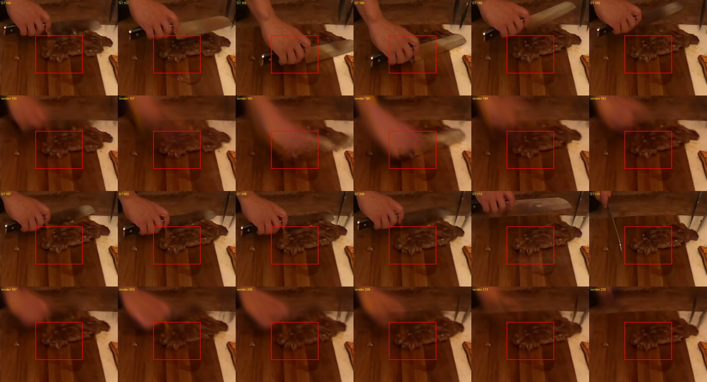

# Real-data gating lane (2026-09-09) — Leonardo

EXPLORATORY, `evidence_bearing: false`. This page executes, in order, the
six-step programme decided on 2026-09-09 after the paired-densification
design was rejected as the first move (see §0). Every number below is
tied to a Leonardo job id or a file on `$WORK/sri/proj_adags`.
Sections are appended as results return; nothing is rewritten.

## 0. Why not paired densification (decision, no compute)

Recorded before any cell ran. The shared-densification design (option 3
of [[n3v-paired-design-packet-2026-08-24]]) was NOT taken because:

1. it pins the amplifier, not the source — divergence begins at iteration
   2–3 at 1e-8 from float nondeterminism ([[b1f-flow-postmortem-2026-08-23]])
   and whether the continuous dynamics alone stay within 0.05 dB with
   topology pinned is unmeasured;
2. it removes a channel the code shows is real: the presence gate
   multiplies opacity BEFORE rasterisation while `visibility_filter` is
   `radii > 0`, so a gated row during its gap still counts as visible but
   receives zero positional gradient — its mean accumulated gradient is
   diluted and clone/split fires on it less. That is the mechanism behind
   the fixture's "1,126 fewer primitives"; replaying the ungated arm's
   decisions charges the gated arm for capacity it did not request;
3. prune shares the densify call: replaying the ungated arm's prune
   decisions deletes rows the ungated arm drove to low opacity while they
   fought the occluder — exactly the rows the gated arm preserved for the
   return;
4. the cost premise it was meant to rescue no longer holds (§1).

## 1. Cost, recomputed on Leonardo (measured, not estimated)

Allocation `EUHPC_D36_068` (`saldo -b`, 2026-09-09 01:27 CEST): 144,000
local h, 12,332 consumed (8.6%), ends 2027-05-19. Charged ≈3.5 local h per
GPU-hour ([[leonardo-d36-068-migration-and-immersive-pilot-2026-08-28]]).

Measured wall-clock per cell on A100-SXM-64GB, `boost_usr_prod`, from
`sacct` (jobs of 2026-08-28):

| cell | frames | iterations | train | eval |
|---|---:|---:|---:|---:|
| `ph_p_s0/s1/s2` (50-frame LoRA primitive) | 50 | 6,000 | 1h43–1h46 | 5 min |
| `n3v_t_cut_roasted_beef` (ivv_protocol_300f_6k) | 300 | 6,000 | 1h50 | 8 min |
| six-scene IVV table | 300 | 6,000 | 1h44–1h50 | 10–11 min |

**Iteration count, not frame count, sets the cost**: a 300-frame 6k cell
costs the same as a 50-frame 6k cell. A 12k-truncated canonical cell is
therefore ≈3h40 (extrapolated, to be verified by the first such cell).

| design (two arms) | cells | GPU-h | local h | share of remaining 131,668 local h |
|---|---:|---:|---:|---:|
| 8/arm at 6k (pilot wave) | 16 | 31 | 108 | 0.08% |
| 12/arm at 6k | 24 | 46 | 161 | 0.12% |
| 37/arm at 6k (the n=6 upper-limit figure) | 74 | 142 | 497 | 0.38% |
| 12/arm at 12k-truncated | 24 | 88 | 308 | 0.23% |
| 37/arm at 12k-truncated | 74 | 271 | 950 | 0.72% |

The binding constraints are the 20-job submit cap and wall-clock, not
budget. "181 slot-h is 7.5× the ceiling" was an Apollo block-ceiling
statement; it has no force here. The 37/arm figure itself is the n=6
upper confidence limit on sigma; under an internal-pilot design the
second wave is sized from the pooled sigma of the first, and the upper
limit shrinks with degrees of freedom.

## 2. Supply — can the mechanism fire on the segment?

From [[crb300-event-mask-curation-2026-08-23]] (ground-truth-only): the one
confirmed occlude-and-return on dynamic content is `F`, the beef pile under
a blade, occluded [158,187], revealed [190,209], box `[664,912,744,976]`
(80×64 px) on the held-out camera. Frames 0–49 contain none confirmed, so
the 50-frame protocol cannot exercise a presence gate — a comparison there
would be the block-2026-08-24 vacuity class. The lane therefore uses the
full 300-frame protocol (same cost per cell, §1) and scores `F`.

Pixel-time arithmetic for the primary endpoint: 5,120 px × 20 return
frames = 102,400 pixel-times (0.025% of the 300-frame held-out set);
gap frames 158–187 give 153,600 pixel-times for the ghost diagnostic.
Whole-frame PSNR cannot carry this claim — the region is too small to
move it — so every endpoint below is region-restricted.

The mechanism-exercise precondition, stated about the SETUP and evaluated
before any score (the V3 form): (P1) the program gates > 0 rows on the
cloud it is applied to; (P2) at least one held-out frame in the scored
range lies inside a gap; (P3) the gated rows' rendered footprint on the
held-out camera intersects the `F` box on a pre-occlusion frame. The
evaluator of §4 writes these before any metric.

## 3. Headroom — zero training (job 56843264, COMPLETED 1m26s)

`scripts/event_region_frame_profile.py` on the held-out renders of the
existing 300-frame 6k model
`runs/n3v_ivv/20260828_092924_cut_roasted_beef_ivv300f6k` (job 54705717,
commit `261da34`, best_val PSNR 32.21). Output
`runs/realdata/headroom_ivv300f6k/profile.{json,csv}`. Per-frame PSNR in
the `F` box, held-out cam00:

| frames | content (GT, verified visually) | F-box PSNR |
|---|---|---:|
| 140–152 | beef visible, nothing over it | 33.9–35.5 |
| 153–157 | blade edge entering | 28.7–31.4 |
| 158–187 | hand + blade cover the box | 23.6–26.9 |
| 189–199 | beef back, hand hovering above the box | 33.4–34.2 |
| 200–207 | hand/knife re-enter the top-left of the box | 31.3–32.6 |
| 208–211 | beef clear again | 33.0–33.7 |
| 212–213 | another blade pass | 29.9–30.8 |

Pooled over the curated return window [190,209]: **32.945 dB**, against
≈34.7 on the pre-occlusion frames.

**Reading, and it bounds the whole lane.** The deficit inside the return
window splits into two causes with different owners:

* on the clean return frames 189–199 the beef renders within **≈0.5–1.3 dB**
  of its pre-occlusion level — that is the entire headroom available to a
  presence gate on the primary endpoint, an upper bound of roughly
  **0.8 dB** on half the window;
* the 2–3 dB dip at 200–207 is the OCCLUDER (hand and knife) entering the
  box and being rendered as a blur; gating the beef cannot touch it.

And a channel the curated endpoint does not score: during the occlusion
(frames 165 and 180 in the montage) the beef texture **leaks through a
translucent hand render**. Removing that leak is what an exact gate does;
it is scoreable as F-box PSNR over [158,187] and is recorded as the
secondary "ghost" diagnostic, never pooled with the primary.

Consequence for sizing: the expected primary effect is bounded by ≈0.8 dB
on ten frames and is plausibly a few tenths of a dB pooled over twenty;
the replicate floor on a 102k-pixel-time region will exceed the 0.4945 dB
measured on the 340k-pixel-time union. The training comparison (§6) is
therefore run as an internal pilot whose first wave exists to measure
sigma on THIS region, not to claim an effect.

## 6. Training comparison — FROZEN SPEC (draft; freeze status recorded at the end of this section)

Written BEFORE any gated cell exists and before any ungated cell's
event-region number has been read. The eight ungated cells were submitted
at 01:45 CEST (jobs 56844727, 56844733–56844739) under a reading rule: the
cell script writes `f_box_profile.json` and `event_ray_metrics.json`
mechanically at the end of each cell, but no `F`-box number from them is
READ by anyone until this section is marked FROZEN below.

### 6.1 Arms and protocol

| arm | config | seeds | what differs |
|---|---|---|---|
| U (ungated) | `configs/n3v/b0c_crb300_12k_rp.yaml` | 0–7 | — |
| G (gated) | `configs/n3v/elgs_local_crb300_12k.yaml` | 0–7 | the `elgs_*` block only: localized total presence gate seeded from a frozen program in `spatial_voxel` mode, rounds off, pins off, boundaries frozen |
| G-mis (localized positive control) | as G with the program's gap shifted +15 frames | 0–2 | gates the beef while it is VISIBLE (frames 173–202); a known-sign, localized, large effect through the identical machinery |

Protocol: `cut_roasted_beef`, 300 frames, 1352×1014, cam00 held out,
12,000 iterations of the canonical 36k schedule (§1), 600k cap, batch 2,
`route_logit_init 4.0`. Arms are INDEPENDENT samples: seeds are not
treated as pairs, because same-seed same-code runs separate as much as
different-seed runs at this protocol
([[same-code-replicate-floor-spec-2026-08-23]]).

**Correction before freeze (02:00 CEST, append-only).** The first eight
ungated cells (jobs 56844727, 56844733–56844739, config
`b0c_crb300_12k.yaml`) were CANCELLED at ~15 min and resubmitted as jobs
56845450–56845452, 56845454–56845457, 56845464 with
`configs/n3v/b0c_crb300_12k_rp.yaml`. Reason, found by the evaluator
worker in code: every EL-GS run withholds the `(frame_order + camera_order)
% 4 == 0` diagonal (~25% of training units) UNCONDITIONALLY
(`setup_elgs` builds the reserved pool for every EL-GS run and `main.py`
applies `filter_elgs_reserved` whenever EL-GS state exists), so a gated
arm trains on ~4,275 of 5,700 units. The comparator must withhold the same
units (`elgs_reserved_parity: true`, the mechanism the LRV3 A0′/A1-LOCAL
pair used). Consequence disclosed: the U substrate here is NOT the
canonical B0-C number; it trains on 75% of the units. No output of the
cancelled cells was read.

### 6.2 Endpoints (all from `scripts/event_ray_metrics.py` on the `--val`
renders at 12,000 iterations, box `F`, held-out cam00)

* PRIMARY: `F` pooled PSNR over the curated return window [190,209]
  (102,400 pixel-times).
* SECONDARY ghost diagnostic: `F` pooled PSNR over the gap [158,187],
  reported separately, never pooled with the primary.
* HARM GUARD: whole-frame pooled+clamped PSNR over all 300 held-out
  frames; G must not be worse than U by more than the pooled ungated
  replicate sd. Reported, not a stopping condition.
* Capacity: final point count per arm (the topology channel of §0).

### 6.3 Precondition (evaluated from the SETUP, before any score)

For every G cell, from its seeding log (`elgs_seeding`): gated rows at
seeding > 0, and the seeding cloud's gated rows lie inside the program's
spatial extent; and, from the frozen program itself: the gap [158,187]
contains ≥ 1 held-out frame (trivially 30). A G cell failing the first
clause is INVALID and is reported as such, not scored.

### 6.4 Placebo and positive control

* Identical-arm placebo: the eight U cells split by seed parity
  (0,2,4,6 vs 1,3,5,7). The difference of means on the primary endpoint
  is the placebo statistic; its magnitude is what "no effect" looks like
  through this exact pipeline.
* Localized positive control: G-mis (6.1). Its primary-endpoint delta
  against U must be NEGATIVE and larger in magnitude than the placebo
  statistic, or the design has no demonstrated power and no G result may
  be read as a null.

### 6.5 Analysis, fixed in advance

Welch two-sample t on the primary endpoint, G vs U, two-sided α = 0.05.
A pre-treatment covariate is admitted ONLY if it is measured before
iteration 500 (the first densification round) and its correlation with
the primary endpoint across the eight U cells has |r| ≥ 0.5; the
candidate is the per-cell training L1 averaged over iterations 400–499
(read from the tfevents). If admitted, the reported estimate is the
ANCOVA-adjusted difference; if not, the raw difference. Both are
reported either way.

Internal pilot: wave 1 = 8 U + 8 G (+3 G-mis). From the pooled sd of the
16 cells on the primary endpoint, `n2 = ceil(2 · 7.8489 · (s/δ)² + 0.9604)`
per arm at δ = 0.30 dB. If `n2 ≤ 16`, run wave 2 to `n2`; if
`16 < n2 ≤ 40`, run wave 2 to `n2` (cost is not binding, §1); if
`n2 > 40`, STOP and report the estimate with its CI as inconclusive at
δ = 0.30 — the lane does not chase a smaller effect than the headroom
bound (§3) supports.

### 6.6 Reading rules

* An effect is CLAIMED only if the CI excludes zero AND G-mis passed 6.4
  AND every G cell passed 6.3.
* A null is REPORTED (not "gating does not help") only if G-mis passed
  6.4; otherwise the outcome is "design without power", recorded as
  such.
* The ghost diagnostic and the capacity count are reported alongside
  whatever the primary says; neither rescues a primary null.

FREEZE STATUS: **DRAFT** — becomes FROZEN when the program's sha256, the
gated config's content hash and the G-mis program's sha256 are appended
here, before the first G cell is submitted.

## 6-v2. Training comparison — FROZEN SPEC v2 (supersedes the §6 draft after external review)

The §6 draft was sent to an external adversarial reviewer (Codex, review
text preserved in the session record; 18 numbered defects, verdict DO NOT
SUBMIT). Every accepted defect and its disposition:

| # | defect (paraphrased) | disposition |
|---|---|---|
| 1 | the gate acts in [158,187] but the primary was the return window; occlusion ≠ absence | ACCEPTED: P1 = ghost window [158,187] is primary, framed as suppression of occlusion leakage, not presence; P2 = the visually clean return [190,199]; the curated [190,209] is secondary |
| 2–4 | precondition dropped the footprint clause and reported a bare "> 0" | ACCEPTED: three clauses restored with numerators and denominators, frozen minimum thresholds |
| 5 | G-mis window [173,202] is partly occluded | ACCEPTED: G-mis gates [118,147], every frame visually verified unobstructed (montage `realdata-crb-f-box-montage-pre-2026-09-09.jpg`) |
| 6 | positive control acceptance too weak | ACCEPTED: n = 8, CI entirely below 0 AND ≤ −1.0 dB, on its own window |
| 7 | no magnitude-vs-correctness control | ACCEPTED: G-mis IS the matched-magnitude sham (same rows, same duration, wrong time); the G-vs-G-mis contrast on P1/P2 is pre-specified and gates the claim |
| 8 | one 4-vs-4 split is not a null distribution | ACCEPTED: all 35 balanced splits of U, 95th percentile of the absolute difference |
| 9–10 | covariate is post-treatment and selected on outcomes | ACCEPTED: ANCOVA removed entirely |
| 11–12 | sizing ambiguous, cap guarantees the stop branch, stop conflicts with claim | ACCEPTED: blinded within-arm pooled sd; cap raised to 60/arm; a feasibility stop forbids any claim |
| 13–14 | undirected claim; "null" from a wide CI | ACCEPTED: directional 97.5% CIs; "no detected difference" unless TOST at ±0.30 dB passes |
| 15 | harm guard without force | ACCEPTED: frozen 0.15 dB margin on a region-level and a whole-frame guard; failure blocks a benefit claim |
| 16 | reserved-parity match not verified | ACCEPTED: both configs hashed, mechanically diffed, reserved-unit counts compared per cell |
| 17 | asymmetric post-hoc exclusion | ACCEPTED: symmetric rules, ITT and mechanism-exercised analyses both reported, no seed replacement |
| 18 | freeze list incomplete | ACCEPTED: full list in 6-v2.8 |

### 6-v2.1 Arms

| arm | config | seeds | n |
|---|---|---:|---:|
| U | `configs/n3v/b0c_crb300_12k_rp.yaml` (reserved parity on) | 0–7 | 8 |
| G | `configs/n3v/elgs_local_crb300_12k.yaml`, program = frozen spatial membership program, gap = T1's estimated gap | 0–7 | 8 |
| G-mis | as G, program identical except the gap moved to absent frames [118,147] | 0–7 | 8 |

Protocol as §6.1 (300 frames, 12k-truncated canonical, cam00 held out).
Arms are independent samples. G-mis is simultaneously the localized
positive control (scored on its own window) and the matched-magnitude
sham (same rows, same duration, wrong time) for the correctness contrast.

### 6-v2.2 Endpoints (F box, held-out cam00, from each cell's
`f_box_profile.json`; pooled PSNR over a frame set)

| id | frames | role |
|---|---|---|
| P1 ghost | 158–187 | PRIMARY: suppression of leakage through the occluder |
| P2 return_clean | 190–199 | PRIMARY: return quality on visually clean frames |
| S1 return_curated | 190–209 | secondary |
| H1 harm_region | 100–157 | harm guard (gate at presence 1 on a visible object) |
| H2 harm_whole | all 300, whole frame | harm guard |
| C1 control_window | 118–147 | positive control (G-mis vs U only) |
| CAP | final point count | descriptive |

### 6-v2.3 Precondition per G / G-mis cell, from the SETUP, before any score

(a) gated rows at seeding, n/N; (b) gated rows surviving at 12,000
(`_elgs_family_ids >= 0`), n/N, frozen minimum 1,000; (c) gated rows
whose pure projection at frame 150 on cam00 falls inside the F box,
frozen minimum 100; (d) frames with presence exactly 0 on a gated row ≥ 1.
Cells failing any clause are reported, included in the ITT analysis, and
excluded from the mechanism-exercised analysis. Reserved units per cell
must be equal across arms (printed by both code paths).

### 6-v2.4 Analysis — `scripts/realdata_gate_analysis.py` (hash frozen in 6-v2.8)

Welch two-sample t; primaries at α = 0.025 each (97.5% CIs, Bonferroni
over P1/P2). Positive control valid iff G-mis − U on C1 has a 97.5% CI
entirely below 0 and a point estimate ≤ −1.0 dB. Placebo: all 35 balanced
splits of U, 95th percentile of |Δ|. Harm guard fails if the 97.5% upper
bound of U − G on H1 or H2 exceeds 0.15 dB. Correctness contrast: G − G-mis
on P1/P2. TOST equivalence at ±0.30 dB.

Verdict per primary: BENEFIT (CI > 0, |Δ| above the placebo quantile,
control valid, harm guard passes, correctness contrast CI > 0);
BENEFIT_NOT_SEPARABLE (as BENEFIT but the correctness contrast does not
exclude 0); HARM (CI < 0); EQUIVALENT (TOST passes);
NO_DETECTED_DIFFERENCE otherwise; DESIGN_WITHOUT_POWER overrides all when
the control is invalid; FEASIBILITY_STOP overrides all when 6-v2.5 stops.

### 6-v2.5 Sizing — internal pilot

From wave 1 (8 U + 8 G): blinded within-arm pooled sd
`s_p = sqrt((s_U² + s_G²)/2)` per primary; `n2 = ceil(2·9.5049·(s_p/0.30)²
+ 2.2414²/4)` per arm (α 0.025, power 0.80, δ 0.30 dB). `n2 ≤ 8`: wave 1 is
final. `9 ≤ n2 ≤ 60`: run wave 2 to `n2` on U and G (G-mis stays at 8).
`n2 > 60`: FEASIBILITY STOP — the estimate and CI are reported as
inconclusive at δ = 0.30 and no claim is made in any direction. Reference
point: at the recorded floor 0.4945 dB the formula gives 53 per arm.

### 6-v2.6 Failure rules (symmetric)

A cell that crashes is resubmitted once with the same seed; a second
failure is reported as missing. No seed is replaced. Nothing is excluded
on the basis of a score.

### 6-v2.7 Reading rules

A benefit is CLAIMED only under the BENEFIT verdict. A CI crossing zero is
"no detected difference", never "gating does not help". The ghost
diagnostic is P1 itself; the return claim is P2; neither substitutes for
the other. CAP is reported, never a claim.

### 6-v2.8 Freeze list (appended when frozen; the spec is FROZEN only when every line has a value)

FREEZE STATUS: **DRAFT v2** — awaiting: sha256 of both configs and their
mechanical diff, the spatial program (G) and the shifted program (G-mis)
with sha256, the analysis script sha256, the evaluator script sha256, the
mask-manifest sha256, the repository commit, torch version on Leonardo,
seed list 0–7, checkpoint rule `chkpnt12000.pth`.

**Correction to 6-v2.3 (append-only, 02:40 CEST).** "printed by both code
paths" is false: `reserved_indices_for_parity` returns `None` under
`elgs_enable`, and the EL-GS setup line carries no reserved count. The
extractor `scripts/gate_cell_precondition.py` therefore RECOMPUTES the
reserved pool for gated cells from `build_reserved_pool` (the single
implementation both paths call; the diagonal is a function of sorted
frame and camera order, not of the seed) and refuses on any disagreement
between the log line, the restored state and the recomputation. The U
cells' printed number audits the recomputation the G cells depend on.

## 5. Estimators on real footage — PSNR-free results

### 5.1 Episode timing (T1) on the real 300-frame substrate — job 56846762, COMPLETED 2h04m

`scripts/estimate_episodes.py` on `runs/n3v_ivv/20260828_092924_cut_roasted_beef_ivv300f6k/chkpnt6000.pth`
(the ungated 6k model; commit `aa368b1`; report
`runs/realdata/t1_ivv300f6k/episode_estimate_t1.json`, program sha256
`aed65340…ccab55`, estimate sha256 `d33b80a1…83159`). Training cameras
only (1, 6, 11, 16 of the 19), measured frames [140,230], coarse stride 4
plus 64 fine frames, `--skip-scoring`; no held-out image, mask or
annotation was readable (LeakageGuard). Grid: 16 cells per axis over the
[1,99] percentile box of the cloud (§5.1a below explains why), 1,218
candidate groups of ≥ 4 rows, 330,616 ablated renders at 22.1 ms.

| quantity | measured |
|---|---:|
| candidate groups | 1,218 |
| groups GATED | **1** (group 1033, 1,483 rows, one voxel cell) |
| abstained | 1,217 (no_interior_gap 591, contrast 461, empty_footprint 92, camera_disagreement 73) |
| agreeing cameras | 3 of 4 (requirement 3) |
| estimated first ABSENT frame | **159** (curation, from held-out GT only: occluded from 158) |
| estimated first PRESENT frame | **188** (curation: "revealed 190–209"; the GT montage shows the blade withdrawn and the beef visible at 188–189) |
| false activations | 0 by construction of the count (1 of 1,218 gated); whether the ONE gated group is the beef is the §5.2 check |

Reading, bounded: the estimator saw no ground truth and returned one gap
whose boundaries sit within one frame of the curated occlusion at the
onset and inside the curated transition at the offset. This is the
real-data analogue of the LRV3 T1 result, on the object class the fixture
never had (an occlusion, not an absence). What it does NOT yet establish:
that group 1033 is the beef pile (its cell must project into the F box —
§5.2), and that the estimator's selectivity is not luck (one gated group
cannot carry a recall statement; 591 groups abstained on gap shape and
461 on contrast, which is the fixture's abstention profile).

### 5.1a The grid correction, recorded before any result was read

The first run (job 56845615, frozen 8-cell grid over the raw bounding
box) produced **23 groups** — the raw box spans ~60 units while 98% of
rows sit in a 5×11×7 box — and gated none (the run stopped at "no group
was gated"). The grid was moved to 16 cells over the [1,99] percentile
box by a setup rule on the cloud alone (cell edge 0.33×0.71×0.42 vs the
beef pile's ~0.3), recorded as commit `aa368b1` before the 16-cell run
started. The 8-cell null is preserved in the job log; it is the
estimator's instrument failing on scale, not a scene-level negative.

### 5.2 Membership — first attempt FAILED at DEVA harmonisation (job 56847950)

`scripts/realdata_membership_vote.py` restored the model, resolved the
1,483 seed rows, and refused at the first view: no DEVA id had ≥ 50% of
its pixels with seed contribution S > 0.5 (best 4.4%). S = Σ α_i T_i over
1,483 of 599,478 rows is a thin footprint; the "fraction of the id above
a threshold" rule cannot fire on it. A diagnostic mode (S maps, per-id
S-mass, and the seed rows' pure projection into every camera including
the held-out one for the F-box check) and an S-mass harmonisation rule
are being added; the retuned rule is chosen on the S-map diagnostic, not
on any score.

## 7. State at the access block (2026-09-09 11:28 CEST) and resume runbook

The Leonardo user certificate (12 h validity, 2026-09-08 23:26 →
2026-09-09 11:26) expired; every remote step below waits on a renewed
login. Nothing was lost: all jobs either completed or are queued with
dependencies.

**Completed and verified on disk**

| step | artefact | job |
|---|---|---|
| headroom profile (§3) | `runs/realdata/headroom_ivv300f6k/profile.{json,csv}` | 56843264 |
| DEVA id masks, 18 training cameras (+cam15 pre-existing), cam00 untouched | `repo/sa4d/data/dynerf/cut_roasted_beef/camXX/pseudo_label/object_mask/` | 56842373, 56842374 |
| T1 timing on the real substrate (§5.1) | `runs/realdata/t1_ivv300f6k/{episode_estimate_t1,estimated_program_v2}.json` | 56846762 |
| 8 U cells, unit-matched, 12k, seeds 0–7 (§6-v2.1); endpoints written mechanically, NOT read | `runs/realdata_gate/20260909_015259_cut_roasted_beef_ug12krp_s{0..7}/` (3h55–4h17 each, all COMPLETED 0:0) | 56845450–56845452, 56845454–56845457, 56845464 |

**Submitted, outcome unread at the block**: U-cell `precondition.json`
extraction (56946143).

**Failed and diagnosed**: membership vote 56847950 (DEVA harmonisation on
a thin seed, §5.2); gate evaluation 56847952 cancelled by dependency.

**Partial freeze, hashes taken on the Leonardo checkout at commit
`ea457ca`, torch 2.5.1+cu121** (programs and the final commit still to
be added):

| file | sha256 |
|---|---|
| `configs/n3v/b0c_crb300_12k_rp.yaml` (U) | `9d1f74de…d073d3` |
| `configs/n3v/elgs_local_crb300_12k.yaml` (G) | `ed672c18…3168f2` |
| `configs/n3v/elgs_local_crb300_12k_mis.yaml` (G-mis) | `e55430b7…6dd128` |
| `scripts/realdata_gate_analysis.py` | `a6650b60…bf5e00` |
| `scripts/eval_n3v_gated.py` | `be8b14f2…267fd8` |
| `scripts/gate_cell_precondition.py` | `360d5a58…fd396b` |
| `scripts/event_region_frame_profile.py` | `63050ccd…05428a` |
| `scripts/event_ray_metrics.py` | `87471840…51c14e` |
| `configs/n3v/ladder_event_masks_crb0_299.json` | `36332365…cd5df6` |

U and G configs verified identical outside the `elgs_*` block; G and
G-mis differ only in the program path.

**Resume runbook (in order; every script is under
`$W/agent-control/realdata/`, every job id goes into `jobs/ledger.txt`)**

1. `sbatch memb_diag.sbatch` — seed-footprint diagnostic (S maps, per-id
   S-mass, seed projection incl. the F-box count on cam00 at frame 150).
   READ `diag.json` and the PNGs; decide `--id_rule mass --mass_cover
   --id_min_mass_frac` from the S-mass table, and confirm the seed cell
   projects into the F box (otherwise group 1033 is not the beef and the
   lane stops at §5.1 with T1's boundaries unattributed).
2. Edit `membership.sbatch` (rewrite whole file) with the chosen rule;
   `sbatch membership.sbatch`, then `sbatch --dependency=afterok:<id>
   gate_eval.sbatch` — the render-time gate on the 6k model (§4), which
   also writes the P1–P3 precondition before any metric.
3. Copy `membership_program_spatial.json` →
   `configs/n3v/crb300_program_spatial.json` and
   `membership_program_spatial_mis118_147.json` →
   `configs/n3v/crb300_program_spatial_mis118_147.json`; commit; record
   their sha256 and the commit in 6-v2.8; mark the spec FROZEN.
4. Submit G (seeds 0–7) and G-mis (seeds 0–7) with `train_cell_g.sbatch`
   (`--export=ALL,CONFIG=...,SEED=s,RUN_TAG=g12k_s<s>,PROGRAM=<path>`),
   respecting the 20-job cap.
5. Build the manifest from `jobs/cells.txt` and run
   `scripts/realdata_gate_analysis.py --manifest ... --wave 1`; apply
   6-v2.5.
